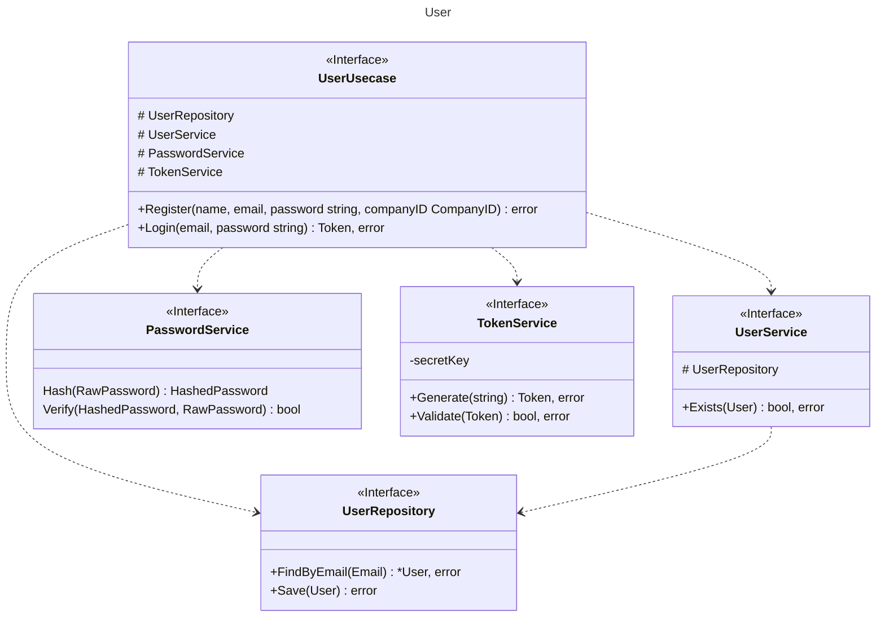
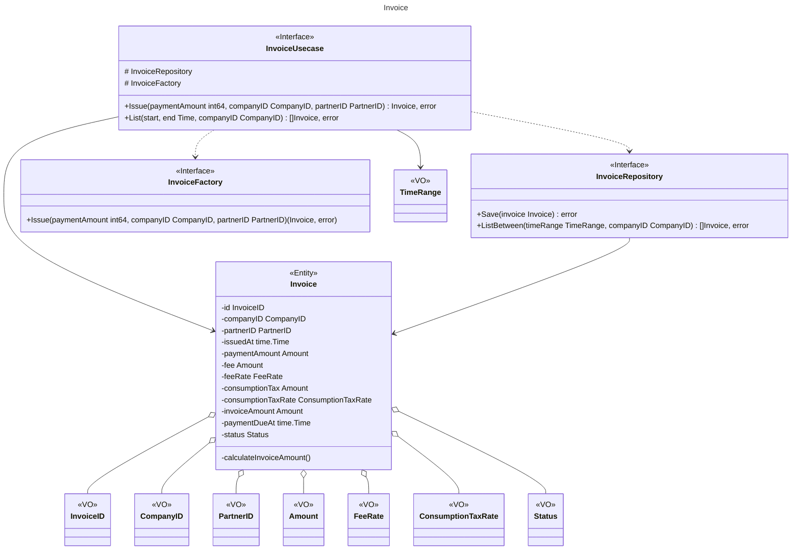

# 主要クラス図

## user

```mermaid
---
title: User
---
classDiagram

  class UserUsecase {
    <<Interface>>
    # UserRepository
    # UserService
    # PasswordService
    # TokenService
    +Register(name, email, password string, companyID CompanyID) error
    +Login(email, password string) Token, error
  }
  class UserRepository {
    <<Interface>>
    +FindByEmail(Email) *User, error
    +Save(User) error
  }
  class UserService {
    <<Interface>>
    # UserRepository
    +Exists(User) bool, error
  }

  class PasswordService {
    <<Interface>>
    Hash(RawPassword) HashedPassword
    Verify(HashedPassword, RawPassword) bool
  }
  class TokenService {
    <<Interface>>
    -secretKey
    +Generate(string) Token, error
    +Validate(Token) bool, error
  }

  UserUsecase ..> UserRepository
  UserUsecase ..> UserService
  UserUsecase ..> PasswordService
  UserUsecase ..> TokenService

  UserService ..> UserRepository
```

## invoice

```mermaid
---
title: Invoice
---
classDiagram

  class InvoiceUsecase {
    <<Interface>>
    # InvoiceRepository
    # InvoiceFactory
    +Issue(paymentAmount int64, companyID CompanyID, partnerID PartnerID) Invoice, error
    +List(start, end Time, companyID CompanyID) []Invoice, error
  }

  class InvoiceRepository {
    <<Interface>>
    +Save(invoice Invoice) error
    +ListBetween(timeRange TimeRange, companyID CompanyID) []Invoice, error
  }

  class InvoiceFactory {
    <<Interface>>
    +Issue(paymentAmount int64, companyID CompanyID, partnerID PartnerID) (Invoice, error)
  }

  class Invoice {
    <<Entity>>
    -id InvoiceID
    -companyID CompanyID
    -partnerID PartnerID
    -issuedAt time.Time
    -paymentAmount Amount
    -fee Amount
    -feeRate FeeRate
    -consumptionTax Amount
    -consumptionTaxRate ConsumptionTaxRate
    -invoiceAmount Amount
    -paymentDueAt time.Time
    -status Status
    -calculateInvoiceAmount()
  }
  class InvoiceID {
    <<VO>>
  }
  class CompanyID {
    <<VO>>
  }
  class PartnerID {
    <<VO>>
  }
  class Amount {
    <<VO>>
  }
  class FeeRate {
    <<VO>>
  }
  class ConsumptionTaxRate {
    <<VO>>
  }
  class Status {
    <<VO>>
  }
  class TimeRange {
    <<VO>>
  }

  Invoice o-- InvoiceID
  Invoice o-- CompanyID
  Invoice o-- PartnerID
  Invoice o-- Amount
  Invoice o-- FeeRate
  Invoice o-- ConsumptionTaxRate
  Invoice o-- Status

  InvoiceUsecase ..> InvoiceRepository
  InvoiceUsecase ..> InvoiceFactory
  InvoiceUsecase --> Invoice
  InvoiceUsecase --> TimeRange
  InvoiceRepository --> Invoice
```
