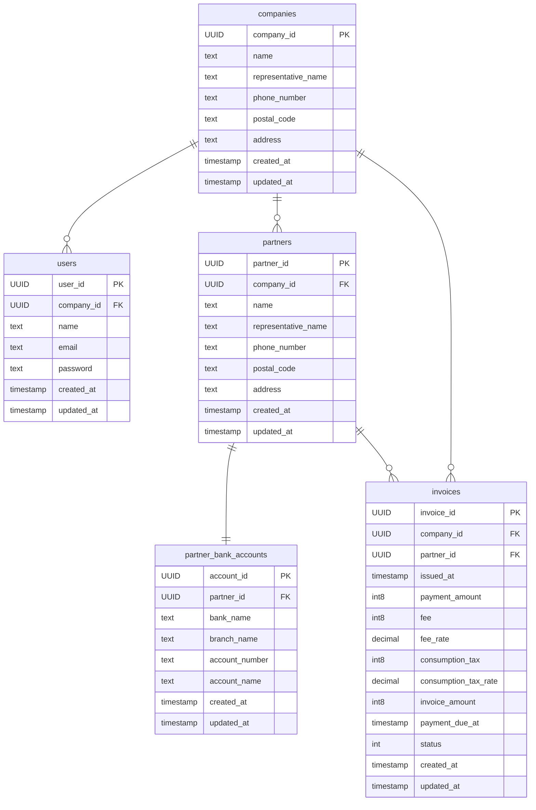

# ER図

```mermaid
erDiagram
    companies {
        UUID company_id PK
        text name
        text representative_name
        text phone_number
        text postal_code
        text address
        timestamp created_at
        timestamp updated_at
    }
    
    users {
        UUID user_id PK
        UUID company_id FK
        text name
        text email
        text password
        timestamp created_at
        timestamp updated_at
    }
    
    partners {
        UUID partner_id PK
        UUID company_id FK
        text name
        text representative_name
        text phone_number
        text postal_code
        text address
        timestamp created_at
        timestamp updated_at
    }

    partner_bank_accounts {
        UUID account_id PK
        UUID partner_id FK
        text bank_name
        text branch_name
        text account_number
        text account_name
        timestamp created_at
        timestamp updated_at
    }

    invoices {
        UUID invoice_id PK
        UUID company_id FK
        UUID partner_id FK
        timestamp issued_at
        int8 payment_amount
        int8 fee
        decimal fee_rate
        int8 consumption_tax
        decimal consumption_tax_rate
        int8 invoice_amount
        timestamp payment_due_at
        int status
        timestamp created_at
        timestamp updated_at
    }

    companies ||--o{ users : ""
    companies ||--o{ partners : ""
    partners ||--|| partner_bank_accounts : ""
    companies ||--o{ invoices : ""
    partners ||--o{ invoices : ""
```
