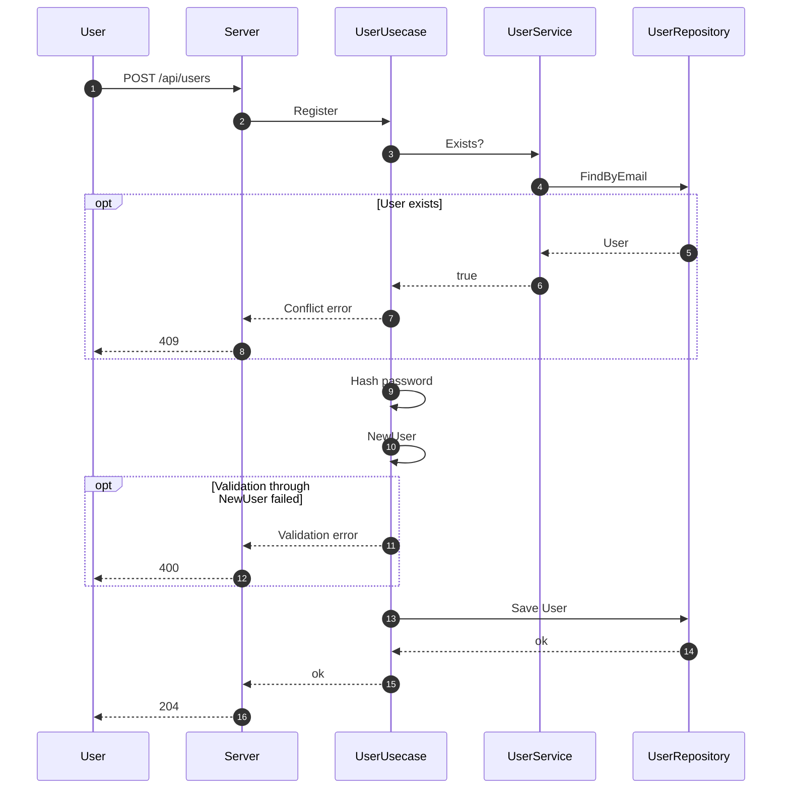
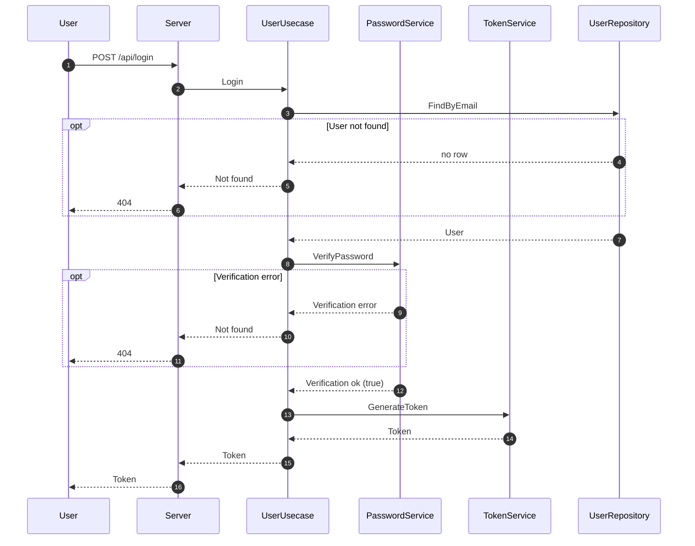
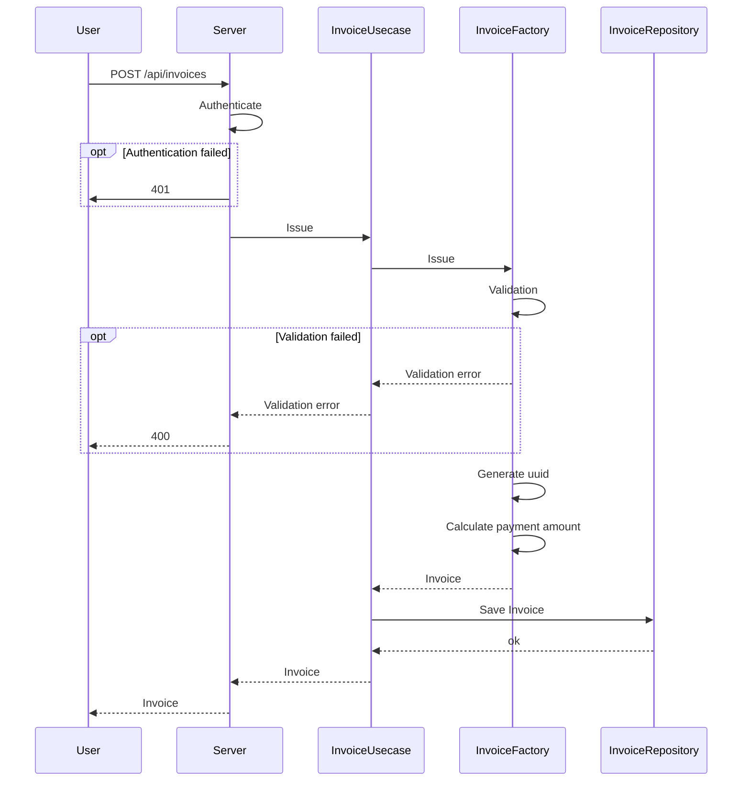
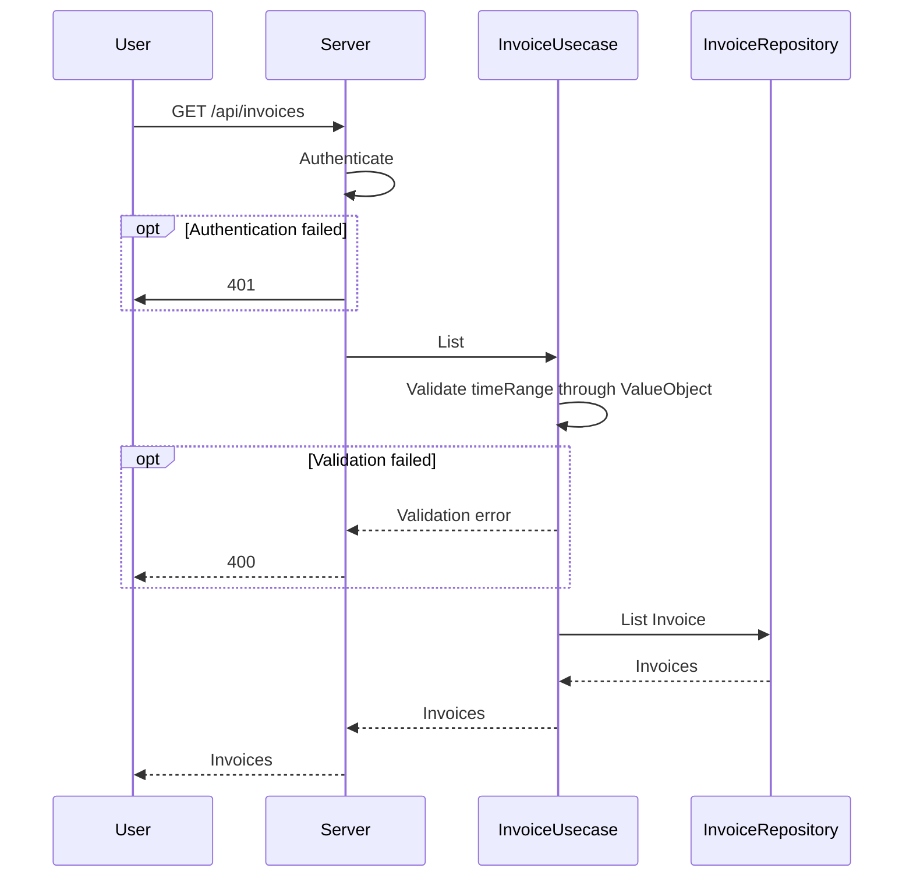

# API処理シーケンス

## POST /api/users

```mermaid
sequenceDiagram
  autoNumber
  participant Usr as User
  participant Srv as Server
  participant Usc as UserUsecase
  participant Svc as UserService
  participant Rps as UserRepository

  Usr ->> Srv: POST /api/users
  Srv ->> Usc: Register
  Usc ->> Svc: Exists?
  Svc ->> Rps: FindByEmail
  opt User exists
    Rps -->> Svc: User
    Svc -->> Usc: true
    Usc -->> Srv: Conflict error
    Srv -->> Usr: 409
  end
  Usc ->> Usc: Hash password
  Usc ->> Usc: NewUser
  opt Validation through NewUser failed
    Usc -->> Srv: Validation error
    Srv -->> Usr: 400
  end
  Usc ->> Rps: Save User
  Rps -->> Usc: ok
  Usc -->> Srv: ok
  Srv -->> Usr: 204
```

## POST /api/login

```mermaid
sequenceDiagram
  autoNumber
  participant Usr as User
  participant Srv as Server
  participant Usc as UserUsecase
  participant PSvc as PasswordService
  participant TSvc as TokenService
  participant Rps as UserRepository

  Usr ->> Srv: POST /api/login
  Srv ->> Usc: Login
  Usc ->> Rps: FindByEmail
  opt User not found
    Rps -->> Usc: no row
    Usc -->> Srv: Not found
    Srv -->> Usr: 404
  end
  Rps -->> Usc: User
  Usc ->> PSvc: VerifyPassword
  opt Verification error
    PSvc -->> Usc: Verification error
    Usc -->> Srv: Not found
    Srv -->> Usr: 404
  end
  PSvc -->> Usc: Verification ok (true)
  Usc ->> TSvc: GenerateToken
  TSvc -->> Usc: Token
  Usc -->> Srv: Token
  Srv -->> Usr: Token
```

## POST /api/invoices

```mermaid
sequenceDiagram
  participant Usr as User
  participant Srv as Server
  participant Usc as InvoiceUsecase
  participant Fct as InvoiceFactory
  participant Rps as InvoiceRepository

  Usr ->> Srv: POST /api/invoices
  Srv ->> Srv: Authenticate
  opt Authentication failed
    Srv ->> Usr: 401
  end
  Srv ->> Usc: Issue
  Usc ->> Fct: Issue
  Fct ->> Fct: Validation
  opt Validation failed
    Fct -->> Usc: Validation error
    Usc -->> Srv: Validation error
    Srv -->> Usr: 400
  end
  Fct ->> Fct: Generate uuid
  Fct ->> Fct: Calculate payment amount
  Fct -->> Usc: Invoice
  Usc ->> Rps: Save Invoice
  Rps -->> Usc: ok
  Usc -->> Srv: Invoice
  Srv -->> Usr: Invoice
```

## GET /api/invoices

```mermaid
sequenceDiagram
  participant Usr as User
  participant Srv as Server
  participant Usc as InvoiceUsecase
  participant Rps as InvoiceRepository

  Usr ->> Srv: GET /api/invoices
  Srv ->> Srv: Authenticate
  opt Authentication failed
    Srv ->> Usr: 401
  end
  Srv ->> Usc: List
  Usc ->> Usc: Validate timeRange through ValueObject
  opt Validation failed
    Usc -->> Srv: Validation error
    Srv -->> Usr: 400
  end
  Usc ->> Rps: List Invoice
  Rps -->> Usc: Invoices
  Usc -->> Srv: Invoices
  Srv -->> Usr: Invoices
```
