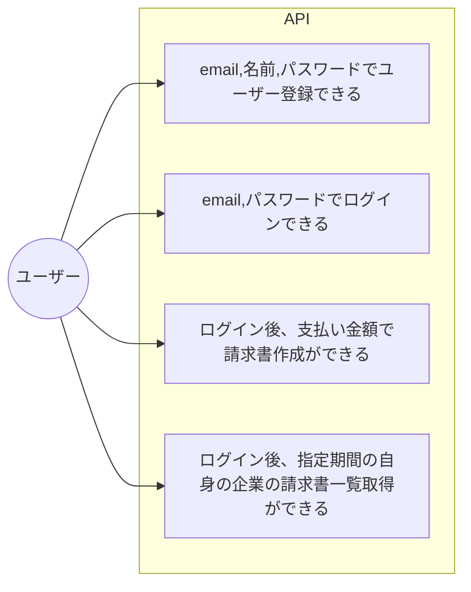

# ユースケース

```mermaid
graph LR
    User((ユーザー))
    subgraph "API"
      RegisterUser[email,名前,パスワードでユーザー登録できる]
      LoginUser[email,パスワードでログインできる]
      CreateInvoice[ログイン後、支払い金額で請求書作成ができる]
      ViewInvoices[ログイン後、指定期間の自身の企業の請求書一覧取得ができる]
    end
    User --> RegisterUser
    User --> LoginUser
    User --> CreateInvoice
    User --> ViewInvoices
```
